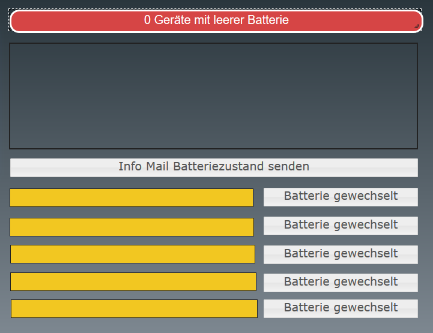
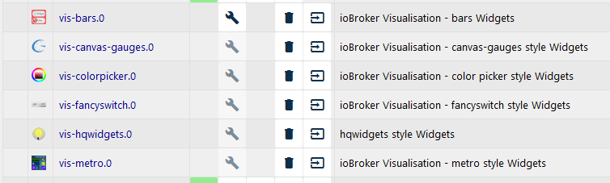

# iobroker.LowBatEMail
Javascript zum versenden von Status Mails bei Aenderung von Batteriezustaenden.

- Versendet eine EMail wenn eine oder mehrere Batterien LowBat signalisiert
- Zaehlt die Laufzeiten der Batterien (aktuelle Laufzeit/ letzter Zyklus)
- Speichert das Datum des letzten Batteriewechsels
- Mailversand kann ueber Objekt Flag auch manuell ausgelöst werden (z.B. ueber VIS)
- Nur kurzzeitige LowBat Meldungen werden ignoriert 
- Taegliche Statusmail, sofern leere Batterien erkannt wurden
- Kompatibel zur Homematic und Homematic-IP
- Nachruestung weiterer Adaptertypen vorbereitet
- Batteriewechsel kann ueber VIS quittiert werden

------

## Inhaltsverzeichnis

- [Benoetigte Hard/Software](#benoetigte-hard/software)
- [Konfiguration des Scripts](#konfiguration-des-scripts)
- [Ablauf nach Script Start](#ablauf-nach-scriptstart)
- [Steuerung durch VIS](#steuerung-durch-vis)
- [Problembehandlung](#problembehandlung)
- [History](#history)

------

## Benoetigte Hard/Software
- Homematic CCU (auf CCU2 getestet)
- IO-Broker mit ...
  - Java-Script Adapter
  - Email-Adapter


## Konfiguration des Scripts
Bevor das Script gestartet werden kann, muessen noch ein paar Individuelle Einstellungen angepasst werden.

### Adapter anpassen
Als erstes muessen die Adapter, aus denen die Batteriemeldungen ausgelesen werden, konfiguriert werden.
Am Beginn des Scripts findet sich die Zeile

```javascript
var adapterList = [ {header:"", name:"hm-rpc.1.", typ:TOOLTYPE_HM}];
```
Jeder Adapter Eintrag besteht aus 3 Parametern wie folgt:

| Parameter | Zweck                                                        |
| --------- | ------------------------------------------------------------ |
| header:   | Diese Zeichenkette wird jedem Geraetenamen dieses Adapters voran gestellt. Dies kann praktisch sein, wenn man zum Beispiel 2 Haeuser mit Homematic hat und es dann das Geraet "WC-EG" zweimal gibt. So koennen die Geraete spaeter unterschieden werden, z.B. "Gaestehaus-WC-EG" und  "Wohnung-WC-WG". |
| name:     | der Name der Instanz, aus dem die Batterie Zustaende ausgelesen werden, zum Beispiel name:"hm-rpc.1."  **bitte beachten, den Punkt am Ende nicht vergessen!** |
| typ:      | Hier muss der verwendete toolChain angegeben werden, zur Zeit gibt es nur den Typ TOOLTYPE_HM, der die Zustaende von Homematic & Homematic-IP kompatiblen Geraeten lesen und verarbeiten kann. Bei Zukünftigen Erweiterungen wird es noch mehr Typen geben. |

Ist in deiner IObroker Installation die Instanz  "hm-rpc.1" fuer deine Homematic Geraete zustaendig und die Instanz "hm-rpc.2" fuer deine Homematic-IP Geräte zustaendig, muss die Konfiguration folgendermassen aussehen:

```javascript
var adapterList = [ {header:"", name:"hm-rpc.1.", typ:TOOLTYPE_HM}
                    {header:"", name:"hm-rpc.2.", typ:TOOLTYPE_HM}];
```

Bei Bedarf laesst sich die Liste erweitern


### EMail Konfiguration anpassen

Für die Versendung der EMail ist es zwingend noetig, die Adressen festzulegen. Damit ich nicht, bei einer Aenderung der EMail Adresse in allen möglichen Scripts die Adresse abaendern muss, sind diese Adressen in einem Globalen Script interlegt. Sollte dies bei Dir nicht der Fall sein, muessen folgende Zeilen angepasst und aktiviert werden:

```javascript
// EMail Einstellungen wenn nicht Global implementiert hier definieren
// const EMAIL_FROM_ADDRESS  = "fromname@fromdomain.de";
// const EMAIL_TO_ADDRESS    = "toname@todomain.de";
// const EMAIL_SUBJ_HEAD     = "MySystemName: ";
```

### Debug Meldungen konfigurieren

Wenn die Globale Debug-Routine von mir (Siehe [Debug Routine](https://wagotec.de/index.php/iobroker-projekte/18-hausautomation/iobroker/iobroker-projekte/31-iobroker-javascript-debug-routine) ) nicht istalliert wurde, kommt es zu Fehlermeldungen, weil die Funktion "myDebug" nicht vorhanden ist.

Entweder das Debug Script installieren, oder die folgenden Zeilen im Script wahlweise aktivieren:

In dieser Konfiguration werden keine Debug Meldungen ausgegeben:

```javascript
// Wenn die Debugfunktion nicht Global implementiert ist, diese Funktion hier aktivieren
function myDebug (debugtext){
//  log(debugtext);               // Ausgabe der Debugtexte bei Bedarf aktivieren
}
```
In dieser Konfiguration werden Debug Meldungen im log ausgegeben:
```javascript
// Wenn die Debugfunktion nicht Global implementiert ist, diese Funktion hier aktivieren
function myDebug (debugtext){
  log(debugtext);               // Ausgabe der Debugtexte bei Bedarf aktivieren
}
```
## Ablauf nach Scriptstart

- 30 Sekunden nach Start, versendet das Script eine EMail, in der alle bekannten Geraete, die Batterie betrieben sind, aufgelistet sind
- Wechselt der Status einer Batterie dauerhaft auf BatteryLow, wird nach einiger Zeit, eine Status Mail mit den leeren Batterien versendet
- Sind leere Batterien vorhanden, wird taeglich eine StatusMail ueber den Zustand aller vorhandener Geraete versendet.
- Taeglich wird die Laufzeit der Batterien erfasst und angepasst, dabei werden kurzfristige LowBat Meldungen wieder herunter gezaehlt.

## Steuerung durch VIS
Die Steuerung und Status Anzeige und der Batteriewechsel kann ueber eine VIS View erfolgen.

Die View sieht folgendermassen aus:



Ein Klick auf das Feld "Info Mail Batteriezustand senden" versendet eine Statusmail.
Die gelben Felder enthalten die Namen der Geraete, bei denen die Batterie gewechselt werden muss. Ein Klick auf Batterie gewechselt bestaetigt den Batteriewechsel. Dabei wird ueberprueft ob die Batterie auch wirklich OK ist. Im obigen Textfeld wird dann der Erfolg/Misserfolg der Aktion angezeigt.

Die Felder sind nur sichtbar, wenn leere Batterien vorhanden sind.

Die View befindet sich im VIS-Template Ordner

**ACHTUNG!** Laueft das Script nicht unter der Instanz "0" (javascript.0) sondern z.B. auf der Instanz javascript.1, muss die View angepasst werden.
Dazu einfach die Eintraege in der Textdatei durch *"suchen und ersetzen"* austauschen: Suche: "jvascript.0" ersetze mit "javascript.1". Danach kann das Widget in VIS importiert werden.

Oder:

Manuell in VIS anpassen.

Ein Problem das auftreten koennte: Leider kann ich es im Augenblick nicht nachvollziehen, welche Widgets ich unter IObroker installiert habe, die diese View verwendet. Sollte manche Teile nicht in VIS angezeigt werden, bitte pruefen ob folgende Widgets installiert sind:



Genauere Infos bezueglich States sind unter [DeveloperInfo](DeveloperInfo/DeveloperInfo.md) zu finden.

## Problembehandlung

Hier einige Ansaetze zur Problembehandlung

### Erfassung von Geraeten ohne Batterie

<u>Problem:</u> Das Script erfasst Geraete, die ohne Batterie betrieben sind: Kommt vor, insbesondere einige Homematic Geraete, die an 220V betrieben werden, haben einen indicator.lowbat. Diese Geraete koennen von der toolChain auf eine Ausnahmeliste gesetzt werden. Bitte den genauen Geraetetyp auf Github als Issue einstellen, ich versuche dann zeitnah das Geraet auf die Ausnahmeliste zu setzen.
Fuer Entwickler sind hier einige Infos zusammengefasst: [DeveloperInfo](DeveloperInfo/DeveloperInfo.md)

Bei der Integration von "nich Homematic" Geraeten bin ich auf mithilfe angewiesen, da ich die erforderlichen Komponenten ZigBee etc. nicht besitze.

### Fehlerreports

Bitte vorranig ueber ein neues Issue hier auf Github einstellen, oder wenn es nicht anders geht per mail an <support@wagotec.de>. Eine genaue Fehlerbeschreibung ist zwingend anzugeben!

# History

**0.1.3 (2020-05-12)**

- (jogicom)
  - Anpassungen des ReadMe
  - Code neu formatiert und Versionsnummer angepasst

**0.1.2 (2020-05-12)**
- (jogicom)
  - Ready for Final Test

**0.1.0 (2020-05-10)**
- (jogicom)
  - First release auf GitHub


------
